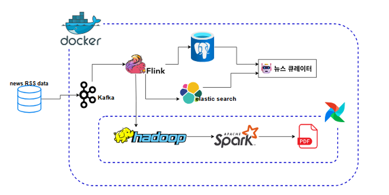
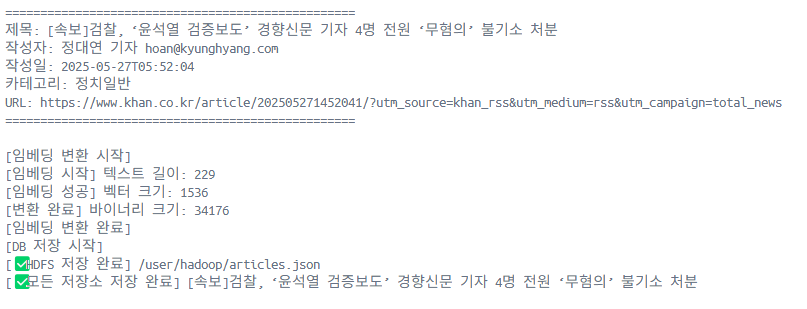
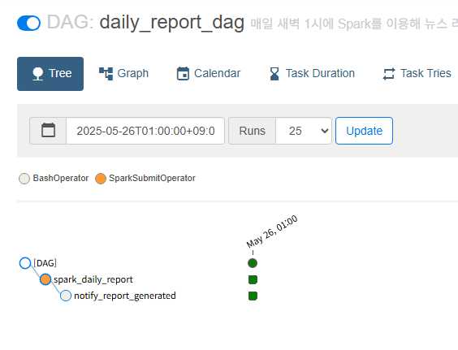
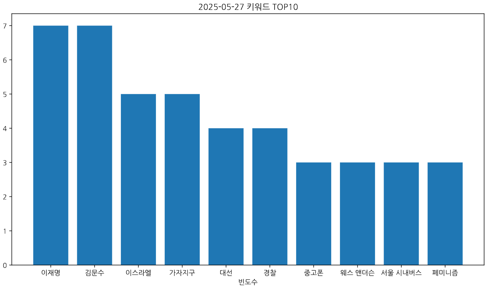
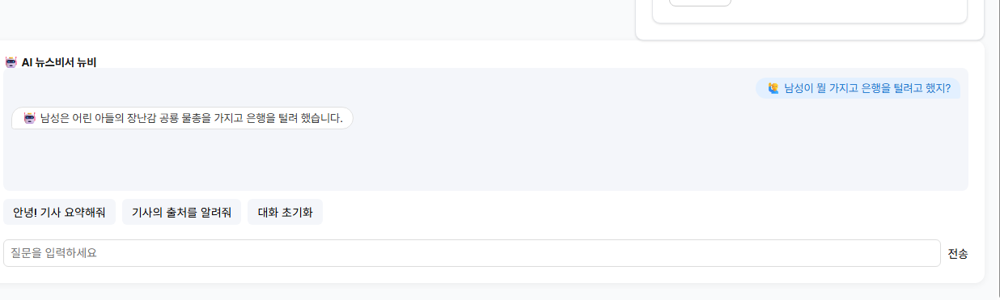
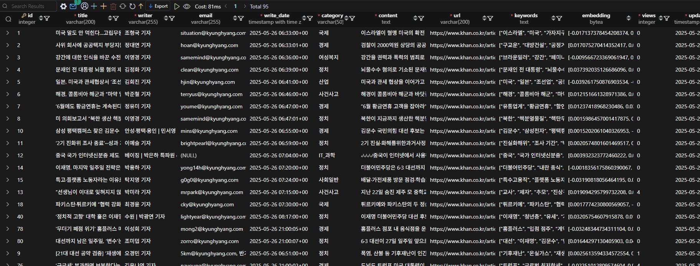
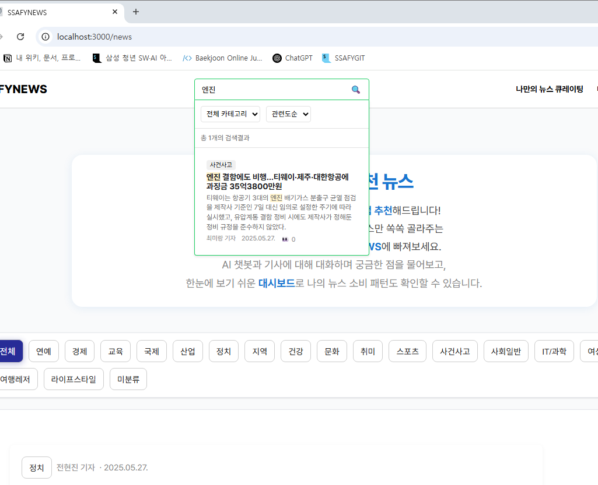
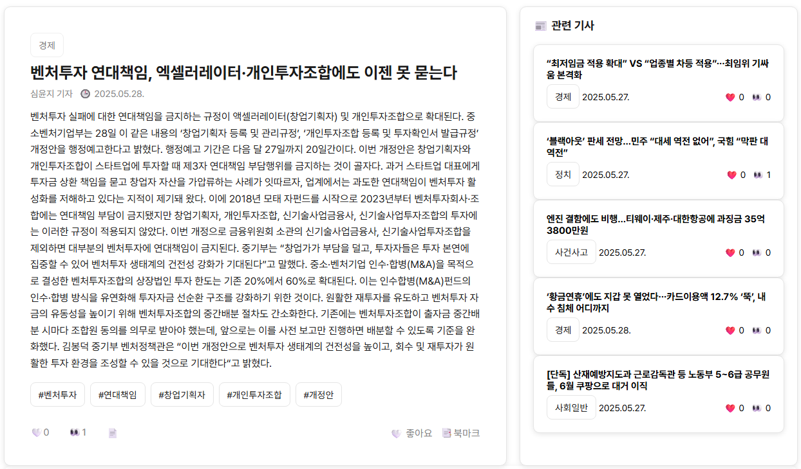
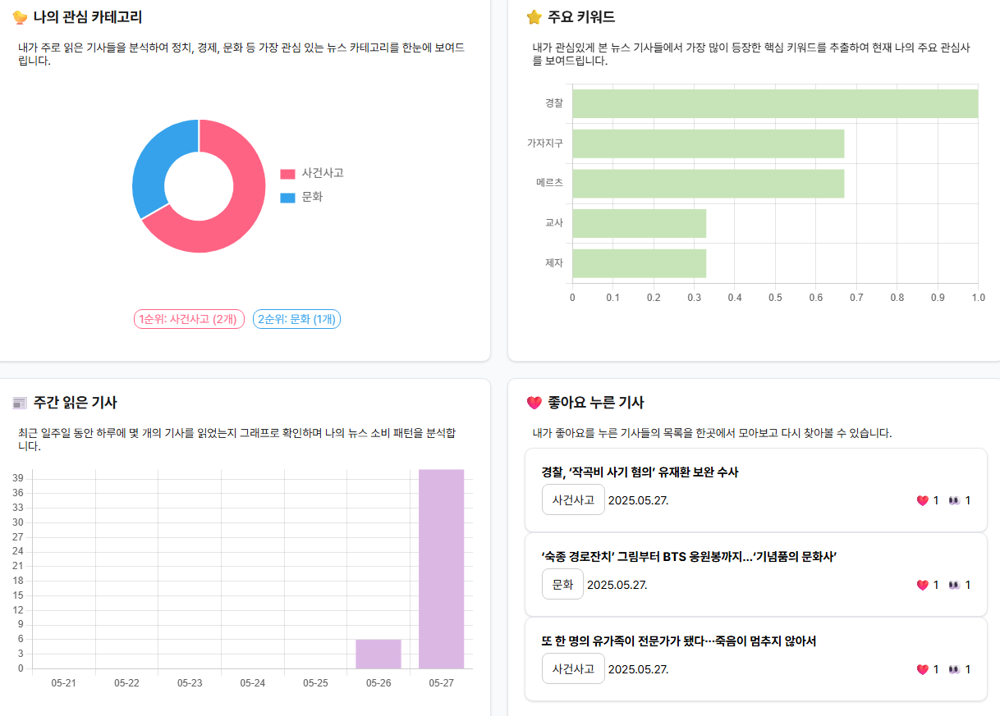

# AI 뉴스 큐레이터

이 프로젝트는 뉴스 데이터를 수집, 분석하고 시각화하는 풀스택 애플리케이션입니다. 프론트엔드, 백엔드, 데이터 파이프라인으로 구성되어 있습니다.

📊 [프로젝트 PPT 보기](https://gamma.app/docs/AI--a6dqk58xoy85ho5)

## 프로젝트 구조

```
PJT/
├── front-pjt/                    # Vue.js 기반 프론트엔드
│   ├── src/                      # 소스 코드
│   │   ├── assets/              # 정적 자원 (이미지, 스타일 등)
│   │   ├── components/          # 재사용 가능한 컴포넌트
│   │   ├── composables/         # Vue 컴포지션 API 관련 로직
│   │   ├── router/              # 라우팅 설정
│   │   ├── views/               # 페이지 컴포넌트
│   │   ├── common/              # 공통 유틸리티
│   │   ├── App.vue              # 루트 컴포넌트
│   │   ├── main.js              # 진입점
│   │   └── axios.js             # API 통신 설정
│   ├── public/                  # 정적 파일
│   ├── Dockerfile               # 프론트엔드 도커 설정
│   └── package.json             # 의존성 관리
│
├── back-pjt/                     # Django 기반 백엔드
│   ├── news/                    # 뉴스 관련 앱
│   │   ├── models.py            # 데이터 모델
│   │   ├── views.py             # API 엔드포인트
│   │   ├── serializers.py       # 데이터 직렬화
│   │   ├── urls.py              # URL 라우팅
│   │   ├── utils.py             # 유틸리티 함수
│   │   └── chatbot/             # 챗봇 관련 기능
│   ├── accounts/                # 사용자 인증 앱
│   ├── config/                  # 프로젝트 설정
│   ├── manage.py                # Django 관리 스크립트
│   └── Dockerfile               # 백엔드 도커 설정
│
└── data-pjt/                     # 데이터 수집 및 처리 파이프라인
    ├── batch/                    # 배치 처리
    │   ├── dags/                # Airflow DAG 정의
    │   ├── logs/                # 로그 파일
    │   ├── Dockerfile.airflow   # Airflow 도커 설정
    │   └── Dockerfile.spark     # Spark 도커 설정
    ├── producer/                 # Kafka 프로듀서
    ├── consumer/                 # Kafka 컨슈머
    └── docker/                   # 도커 관련 설정
```

## 기술 스택

### 프론트엔드 (front-pjt)
- Vue.js 3
- Vite
- Vue Router
- Pinia (상태 관리)
- JavaScript
- Docker
- Axios (API 통신)
- Chart.js (데이터 시각화)

### 백엔드 (back-pjt)
- Django
- Django REST Framework
- Python
- Docker
- PostgreSQL (데이터베이스)

### 데이터 파이프라인 (data-pjt)
- Python
- Docker
- Apache Kafka + Zookeeper (메시지 큐)
- Apache Flink (스트림 처리)
- Apache Airflow (워크플로우 관리)
- Apache Spark (대규모 데이터 처리)
- PostgreSQL (구조화된 데이터 저장)
- Elasticsearch (검색 엔진, Nori 토크나이저)
- HDFS (분산 파일 시스템)
- OpenAI API (GPT-4o-mini, text-embedding-3-small)

## 시스템 아키텍처

### 아키텍처 다이어그램



### 데이터 파이프라인 흐름

#### 1. 데이터 수집 (Producer)
```
RSS 피드
  → 10분마다 크롤링
  → Kafka 토픽("article")으로 전송
```

#### 2. 실시간 처리 (Consumer - Flink)
```
Kafka에서 데이터 소비
  → 전처리 (preprocess.py):
    • 키워드 추출 (GPT-4o-mini)
    • 임베딩 생성 (text-embedding-3-small)
    • 카테고리 분류 (GPT-4o-mini)
    • 기자명/이메일 분리
  → 저장소에 저장:
    • PostgreSQL (구조화된 데이터)
    • Elasticsearch (검색용 인덱싱)
    • HDFS (배치 분석용 원본 데이터)
```

#### 3. 배치 처리 (Batch - Airflow + Spark)
```
매일 새벽 1시 실행 (daily_report_dag.py)
  → Spark로 HDFS 데이터 분석:
    • 일일 키워드 TOP 10 추출
    • 키워드 빈도수 집계
    • 시각화 (막대 그래프)
  → 결과물 생성:
    • PDF 리포트 (report_YYYY-MM-DD.pdf)
    • 원본 데이터 아카이브 (data_YYYY-MM-DD.json)
```

### 기술 스택 상세

| 계층 | 기술 |
|------|------|
| **메시지 큐** | Apache Kafka + Zookeeper |
| **스트림 처리** | Apache Flink |
| **배치 스케줄링** | Apache Airflow |
| **대규모 데이터 처리** | Apache Spark |
| **데이터 저장소** | PostgreSQL, Elasticsearch, HDFS |
| **검색 엔진** | Elasticsearch (Nori 토크나이저) |
| **분산 파일 시스템** | HDFS (Hadoop) |

### 시스템 계층 구조

1. **데이터 수집 계층**
   - Kafka 프로듀서를 통한 뉴스 데이터 수집
   - 실시간 데이터 스트리밍

2. **데이터 처리 계층**
   - Kafka 컨슈머를 통한 데이터 소비
   - Flink를 통한 실시간 스트림 처리
   - Airflow를 통한 배치 작업 스케줄링
   - Spark를 통한 대규모 데이터 처리

3. **백엔드 계층**
   - Django REST Framework를 통한 API 제공
   - 데이터베이스 관리 및 비즈니스 로직
   - 사용자 인증 및 권한 관리

4. **프론트엔드 계층**
   - Vue.js 기반 SPA
   - 실시간 데이터 시각화
   - 사용자 인터페이스

## 시작하기

### 전체 프로젝트 실행 방법

프로젝트의 모든 서비스(프론트엔드, 백엔드, 데이터 파이프라인)를 한 번에 실행하고 종료할 수 있습니다.

1. 프로젝트 실행
```bash
# 프로젝트 루트 디렉토리에서
./start_all.sh
```
이 스크립트는 다음 서비스들을 순차적으로 시작합니다:
1. PostgreSQL 데이터베이스
2. Django 백엔드 서버
3. HDFS (Namenode, Datanode)
4. Kafka 및 Zookeeper
5. Flink (JobManager, TaskManager)
6. Elasticsearch
7. Producer/Consumer
8. Spark 클러스터 (Master, Worker)
9. Airflow Report 서비스
10. Vue.js 프론트엔드 서버

2. 프로젝트 종료
```bash
# 프로젝트 루트 디렉토리에서
./end.sh
```
이 스크립트는 실행 중인 모든 서비스를 안전하게 종료합니다.

### 개별 서비스 실행 방법

각 서비스를 개별적으로 실행하고 싶다면, 각 디렉토리의 README.md 파일을 참조하세요:

- [프론트엔드 README](front-pjt/README.md)
- [백엔드 README](back-pjt/README.md)
- [데이터 파이프라인 README](data-pjt/README.md)

## 개발 환경 설정

### 환경 변수 설정

프로젝트를 실행하기 전에 각 서비스에 필요한 환경 변수를 설정해야 합니다.

#### 백엔드 (back-pjt/.env)
```bash
# Django 설정
SECRET_KEY=your_django_secret_key

# 데이터베이스 설정
DB_NAME=your_db_name
DB_USERNAME=your_db_username
DB_PASSWORD=your_db_password
DB_HOST=your_db_host
DB_PORT=your_db_port

# OpenAI API 설정
OPENAI_API_KEY=your_openai_api_key
```

#### 데이터 파이프라인 (data-pjt/.env)
```bash
# OpenAI API 설정
OPENAI_API_KEY=your_openai_api_key

# 데이터베이스 설정
DB_NAME=your_db_name
DB_USERNAME=your_db_username
DB_PASSWORD=your_db_password
DB_HOST=your_db_host
DB_PORT=your_db_port

# Elasticsearch 설정
ES_HOST=your_elasticsearch_host
ES_PORT=your_elasticsearch_port

# RSS 피드 설정 (복수 URL은 쉼표로 구분)
RSS_FEED_URLS=your_rss_feed_url1,your_rss_feed_url2

# Kafka 설정
KAFKA_BOOTSTRAP_SERVERS=your_kafka_bootstrap_servers
KAFKA_TOPIC=your_kafka_topic
KAFKA_GROUP_ID=your_kafka_group_id

# Flink 설정
FLINK_JAR_PATH=your_flink_jar_path
KAFKA_CLIENT_JAR_PATH=your_kafka_client_jar_path

# HDFS 설정
HDFS_HOST=your_hdfs_host
HDFS_PORT=your_hdfs_port
HDFS_USER=your_hdfs_user
```

각 서비스 디렉토리에 `.env` 파일을 생성하고 위의 환경 변수들을 적절한 값으로 설정해주세요. 실제 값은 보안을 위해 안전하게 관리해야 합니다.

1. 각 디렉토리의 Dockerfile을 사용하여 컨테이너를 빌드하고 실행할 수 있습니다.
2. 로컬 개발 환경에서는 각 디렉토리의 README.md 파일에 명시된 대로 의존성을 설치하고 실행할 수 있습니다.

## 주요 기능

### 실시간 데이터 파이프라인


- RSS 피드 자동 수집 (10분 주기)
- Kafka를 통한 비동기 처리
- Flink로 실시간 전처리 및 저장

### AI 기반 데이터 처리


- GPT-4o-mini로 키워드 추출 및 카테고리 분류
- OpenAI Embedding으로 벡터화 (유사도 검색용)
- 기자명/이메일 자동 분리

### 배치 분석


- Airflow로 일일 리포트 자동 생성
- Spark로 대규모 데이터 집계
- 시각화 리포트 PDF 생성



### 백엔드 API


- RESTful API 엔드포인트
- 사용자 인증 및 권한 관리
- 뉴스 검색 및 조회
- 챗봇 기능 (GPT-4o-mini 기반)





### 프론트엔드


- 반응형 웹 인터페이스
- 뉴스 조회, 검색, 북마크
- 실시간 데이터 업데이트



- 사용자 대시보드

## 라이선스

이 프로젝트는 MIT 라이선스 하에 배포됩니다. 